# Business Rules
This document describes the rules that have to be observed in order that a _solution_ to a _problem instance_ is considered valid.

Your solver will need to make sure that the solutions it produces observe these rules.

We categorize the rules roughly in two groups:
* _Consistency rules_, which mostly check technical conformity to the data model
* _Planning rules_,  which represent the actual business rules involved in generating a timetable

## Concistency Rules

| # | Rule Name         | Rule Definition   | Remarks |
| - | -------           | -----             | ----    |
| 1| problem_instance_hash present      | the field _problem_instance_hash_ is present in the solution and has the correct value (namely that of the problem instance that this solution refers to)                          | |
| 2| each train is scheduled       | For every _service_intention_ in the _problem_instance_, there is exactly one _train_run_ in the solution  | |
| 3 | ordered _train_run_sections_       | For every _train_run_, the field _sequence_number_ of the _train_run_sections_ can be ordered as a strictly increasing sequence of positive integers  | in other words, the _sequence_numbers_ are _unique_ among all _train_run_sections_ for a _train_run_.  Typically, it is natural to also list the _train_run_sections_ in increasing order in the JSON file, such as is the case for the [sample solution](../sample_files/sample_scenario_solution.json). However, strictly speaking de-/serialization from/to JSON need not preserve orders. Having an explicit _sequence_number_ is therefore advisable.   Example: The [sample solution](../sample_files/sample_scenario_solution.json):    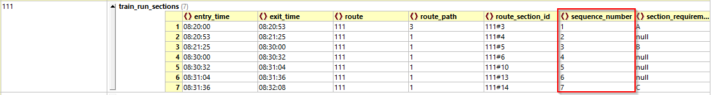 |
| 4 | Reference a valid _route_, _route_path_ and _route_section_      | each _train_run_section_ references a valid (i.e. one that exists) _route_ for this _service_intention_, _route_path_ and _route_section_  | for example, in the [sample_solution](../sample_files/sample_scenario_solution.json):   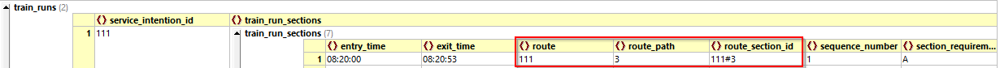 |
| 5 | _train_run_sections_ form a path in the route graph      | If two _train_run_sections_ A and B are adjacent according to their _sequence_number_, say B directly follows A, then the associated _route_sections_ A' and B' must also be adjacent in the route graph, i.e. B' directly follows A'.  | In other words, the _train_run_sections_ form a path (linear subgraph) in the route graph. Check the illustrations in the [Output Data Model description](output_data_model.md#train_runs). |
| 6 | pass through all _section_requirements_      | a _train_run_section_ references a _section_requirement_ if and only if this _section_requirement_ is listed in the _service_intention_. | for example, in the [sample solution](../sample_files/sample_scenario_solution.json), the _train_run_sections_ for _service_intention_ 111 have references to the _section_requirements_ A, B and C. But the _train_run_sections_ for _service_intention_ 113 only reference _section_requirements_ A and C:   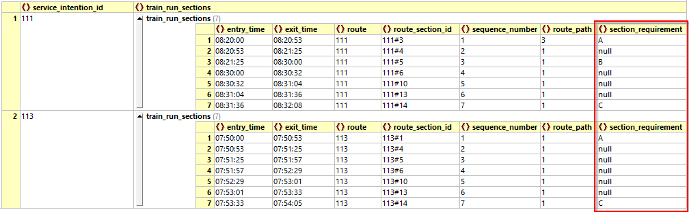   This is because in the [sample instance](sample_files/sample_scenario.json) the _service_intention_ for 113 does not __have__ a _section_requirement_ for the _section_marker_ 'B', but only for 'A' and 'C'   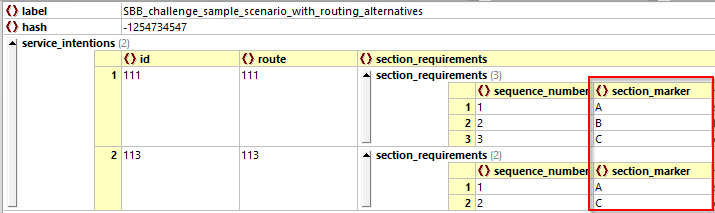
| 7 | consistent _entry_time_ and _exit_time_ times      | for each pair of immediately subsequent _train_run_sections_, say S1 followed by S2, we have S1._exit_time_ = S2._entry_time_ | recall the ordering of the _train_run_sections_ is given by their _sequence_number_ attribute. Again, look at the [sample solution](../sample_files/sample_scenario_solution.json) as an example:   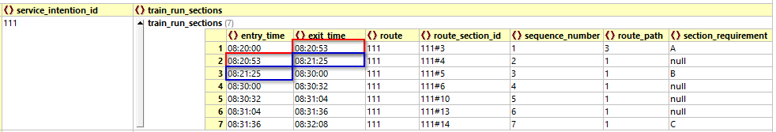|

 

## Planning Rules

| # | Rule Name         | Rule Definition   | Remarks |
| - | -------           | -----             | ----    |
| 101 | Time windows for _latest_-requirements     | If a _section_requirement_ specifies a _entry_latest_ and/or _exit_latest_ time then the event times for the _entry_event_ and/or _exit_event_ on the corresponding _train_run_section_ __SHOULD__ be <= the specified time.   If the scheduled time is later than required, the solution __will still be accepted, but it will be penalized__ by the objective function, see [below](#objective-function).    __Important Remark:__ Among the 12 business rules, this is the _only_ 'soft' constraint, i.e. a rule that _may_ be violated and the solution still accepted.   In some cases, for example for [problem instance 05](../problem_instances/05_V1.02_FWA_with_obstruction.json), it is _impossible_ to schedule all trains satisfying all 12 business rules. In order to obtain feasible solutions, you have no other choice than to delay some of the trains (i.e. violating some _entry_latest_/_exit_latest_ requirements). In such cases, you should of course try to _minimize_ the resulting delay penalty.        | for example, in the [sample instance](../sample_files/sample_scenario.json) for _service_intention_ 111 there is a requirement for _section_marker_ 'C' with a _exit_latest_ of 08:50:00. In the [sample solution](../sample_files/sample_scenario_solution.json) the corresponding _exit_event_ is scheduled at 08:32:08, so well before the required time. Any time not later than 08:50:00 would be just as fine. Any time >= 08:50:01 would incur a lateness penalty as defined in the [objective function](#objective-function) below.   __section_requirement:__  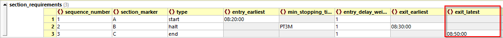  __solution:__  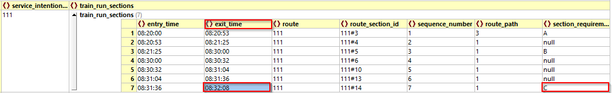 
| 102 | Time windows for _earliest_-requirements     | If a _section_requirement_ specifies an _entry_earliest_ and/or _exit_earliest_ time, then the event times for the _entry_event_ and/or _exit_event_ on the corresponding _train_run_section_ __MUST__ be >= the specified time          | for example, in the [sample instance](../sample_files/sample_scenario.json) for _service_intention_ 111 there is a requirement for _section_marker_ 'A' with an _entry_earliest_ of 08:20:00. Correspondingly, in the [sample solution](../sample_files/sample_scenario_solution.json) the corresponding _entry_event_ is scheduled at precisely 08:20:00. This is allowed. But 08:19:59 or earlier would not be allowed; such a solution would be rejected.     __section_requirement__:  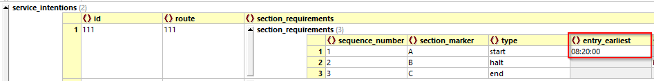    __solution__:  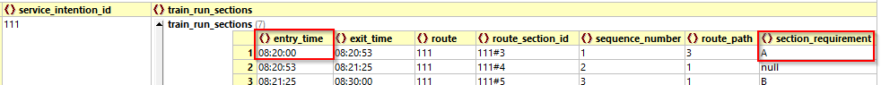|
| 103 | Minimum section time     | For each _train_run_section_ the following holds:   texit - tentry >= minimum_running_time + min_stopping_time, where   tentry, texit are the entry and exit times into this _train_run_section_, minimum_running_time is given by the _route_section_ corresponding to this _train_run_section_ and min_stopping_time is given by the _section_requirement_ corresponding to this _train_run_section_ or equal to 0 (zero) if no _section_requirement_ with a _min_stopping_time_ is associated to this _train_run_section_. | For example, take _train_run_section_ #3 for train 111 in our sample solution. It refers to _route_section_ 111#5. This _route_section_ has a _minimum_running_time_ of 32 seconds, accoring to the sample scenario. Furthermore, on this _train_run_section_ we claim to satisfy _section_requirement_ for _section_marker_ 'B'. That _section_requirement_ requires a _min_stopping_time of 3 minutes. In total, we need to spend at least 3min and 32s on this _train_run_section_ to satisfy this rule. Luckily, we actually spend 8min and 35s (from 08:21:25 until 08:30:00), so we are fine.   __section_requirement:__ 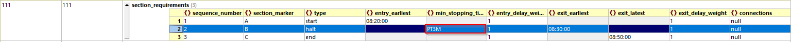  __route_section:__  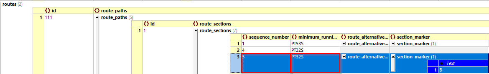  __solution:__  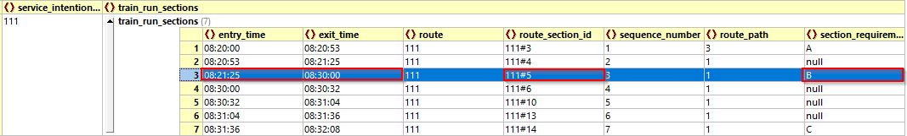|
| 104 | Resource Occupations     | Let S1 and S2 be two _train_run_sections_ belonging to _distinct_ service_intentions T1, T2 and such that the associated _route_sections_ occupy at least one common resource.  Without loss of generality, assume that T1 enters section S1 before T2 enters S2, i.e.   tS1, entry < tS2, entry.   Then for _each commonly occupied resource_ R, the following must hold:   tS2, entry >= tS1, exit + dR, release   where dR, release is the _release_time_ (_freigabezeit_) of resource R| In prose, this means that _if_ a train T1 starts occupying a resource R before train T2, then T2 has to wait until T1 releases it (plus the release time of the resource) before it can start to occupy it.   This rule explicitly need _not_ hold between train_run_sections _of the same train_. The problem instances are infeasible if you require this separation of occupations also among _train_run_sections_ of the same train.   __Example:__ We will see some examples of what this means in the [worked example](worked_example.md)
| 105 | Connections     | Let C be a connection defined in _service_intention_ SI1 onto _service_intention_ SI2 with _section_marker_ M and let dC be the connection's _min_connection_time_.   Let S1 be the _train_run_section_ for SI1 where the connection will take place (i.e. the section which has 'M' in the _section_requirement_ attribute) and S2 the same for SI2. Then the following must hold:  tS2, exit - tS1, entry >= dC,   where, again, tS1, entry denotes the time for the _entry_event_ into _train_run_section_ S1 and tS2, exit the time for the _exit_event_ from _train_run_section_ S2. | Example: The first problem instance with connections is [instance 02](../problem_instances/02_a_little_less_dummy.json). Specifically, let's look at the following connection in 'WAE_Halt' from 18013 to 18224, with a minimum connection time of 2minutes and 30s:  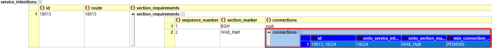  We take the [sample solution for this instance](../problem_instances/sample_solutions/solution_02_a_little_less_dummy.json). The _entry_time_ of 18013 into the relevant _train_run_section_ is 06:42:12:  __solution for 18013__:  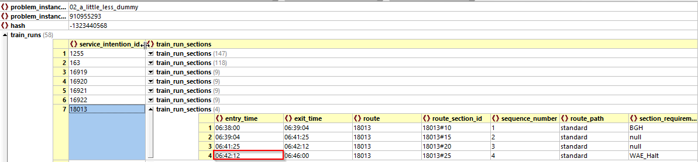   The _exit_time_ of 18224 from its relevant _train_run_section_ is 06:48:04:  __solution for 18224__:  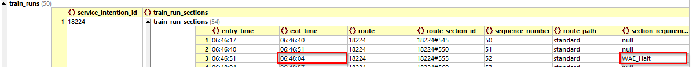  Therefore, we have a time difference of almost 6 minutes between the two events, well above the minimum time span of 2.5 minutes.

## Objective Function
The objective function is used by the grader to determine how "good" a solution is. We give a more exact formula below, but basically it is calculated as the __weighted sum of all delays plus the sum of routing penalties__.
A _delay_ in this context means a violation of a _section_requirement_ with an _exit_latest_ or _entry_latest_ time. Each such violation is multiplied by its _entry_delay_weight_/_exit_delay_weight_ and then summed up to get the total delay penalties.  

__Remark:__ A _missing_ solution in a submission will incur a penalty of 10'000 points. A solution that violates any of the eleven _mandatory_ business rules (all except #101) will be treated like a missing solution.

The best possible objective value a solution can obtain is 0 (zero). A value > 0 means some _latest_entry_/_latest_exit_ _section_requirement_ is not satisfied in the solution, or a route involving _routing_sections_ with _penalty_ > 0 was chosen.

The "formula" for the objective function is as follows:

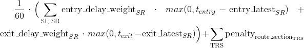

where:
* The first sum is taken over all _service_intentions_ **SI** and all _section_requirements_ **SR** therein,
* The second sum is taken over all _train_run_sections_ **TRS**,
* **entry_delay_weightSR** stands for the _entry_delay_weight_ specified for this particular _section_requirement_. If the _section_requirement_ does not specify an _entry_delay_weight_, then it is assumed to be = 0.
* **tentry** denotes the scheduled time in the solution for the _entry_event_ into the _train_run_section_ associated to this _section_requirement_,
* **entry_latestSR** denotes the desired latest entry time specified in the field _entry_latest_ of the _section_requirement_  _Note_: If the _section_requirement_ does not specify an _entry_latest_, then it is assumed to be &infin;, i.e. the **max** will be zero and the term can be ignored.
* **exit_delay_weightSR** is analogous to **entry_delay_weightSR**, except for the _exit_delay_weight_ of this particular _section_requirement_,
* **texit** denotes the scheduled time of the _exit_event_ from the _train_run_section_ associated to this _section_requirement_,
* **exit_latestSR** is analogous to **entry_latestSR*, except for the _exit_ time (as specified in _exit_latest_ of the _section_requirement_),
* **penaltyroute_sectionTRS** denotes the value of the field _penalty_ of the _route_section_ associated to this _train_run_section_.

__Remark__: All time differences are measured in seconds. The normalization constant 1/60 for the delay penalty term means that 60s of delay will incur 1 penalty point (provided all _delay_weight_ are equal to 1). In other words, we count the delay 'minutes'.

We give a couple of simple examples illustrating the calculation of the delay and routing penalties.

### Examples for Delay Penalties
Suppose the _service_intention_ has the following three _section_requirements_:
* for _section_marker_ A: _entry_earliest_ = 08:50:00
* for _section_marker_ B: 
    - _entry_latest_ = 09:00:00 with _entry_delay_weight_ = 2
    - _exit_latest_ = 09:10:00 with _exit_delay_weight_ = 3
* for _section_marker_ C: _exit_latest_ = 09:220:00 with _exit_delay_weight_ = 1

Suppose also that the routes are rather simple, namely 
* there is only one _route_ (no alterntives), 
* all its _route_sections_ have zero _penalty_ and 
* on the first _train_run_section_ we have _section_marker_ A, then a section without marker, then B, then a section without marker and finally C. 

The complete picture with the _train_run_sections_ and the respective _section_requirements_ would therefore look like this:

We now give several example solutions and the value of the objective function for them. Blue dots denote the actual _event_times_ of the solution, i.e. entry and exit times from _train_run_sections_. The blue lines joining them are purely a visualisation aid, they are not part of the solution.

#### Example 1: No Delay

In this solution, all _section_requirements_ are satisfied. The _entry_ and _exit_ times into the sections are before the desired _entry_latest_/_exit_latest_. Therefore, the delay is zero. Since there is no routing penalty, this is also its objective value:  __objective_value = 0__

#### Example 2: Do Delay
In this solution, the train runs earlier than in [Example 1](#example-1-no-delay). But this is not "better"; it does not get any "bonus points". This solution's objective value is identical to the one of Example 1, i.e.   __objective_value = 0__

#### Example 3: Delayed Departure at B
In this solution, the _exit_ from the _train_run_section_ with _section_marker_ 'B' happens only at 09:13:00. This is 3 minutes later than the desired _exit_latest_ of the _section_requirement_ for 'B'. Since the _exit_delay_weight_ is 3, for this solution we have   __objective_value = 3 * 3 = 9__

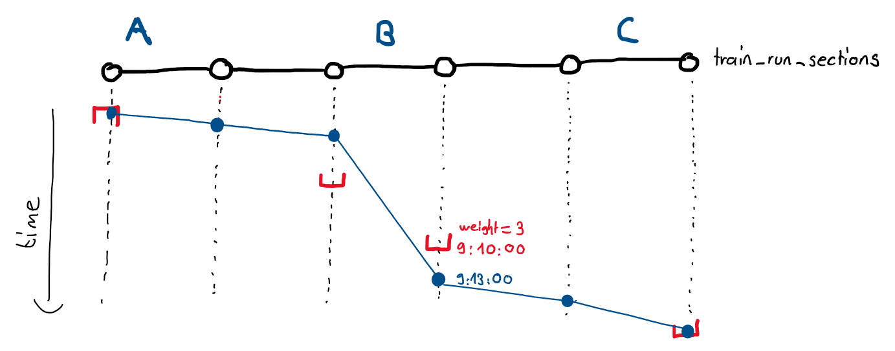

#### Example 4: Delayed Departure at B _and_ Delayed Arrival at C
In this solution, in addition to the delayed departure at B as in Example 3, we also have a delayed _exit_event_ from _section_ C, namely this event occurs 5.5 minutes after the desired _exit_latest_ of 09:20:00. The _exit_delay_weight_ for this _section_requirement_ is 1, therefore:  __objective_value = 3 * 3 + 1 * 5.5 = 14.5__

### Examples for Routing Penalties

Let's take the same routing graph as in the discussion of the [output data model](documentation/output_data_model.md#train_runs), this time augmented with some routing penalties. The route graph looks like this:
* the numbers in __black__ denote the _route_section_._id_
* the numbers in __red__ denote the _route_section_._penalty_. No number means no _penalty_ is specified for this _route_section_

#### Example 1: No Routing Penalty

In the solution, the route highlighted in __yellow__ was chosen.
This route passes through the _route_sections_ 2 -> 4 -> 5 -> 6 -> 11 -> 12 -> 14. None of the _sections_ on this route specify a _penalty_. Since a missing _penalty_ is equivalent to a penalty of zero, the routing penalty for the whole route is also zero.

#### Example 2: Also no Routing Penalty
Also the following solution does not involve any _route_sections_ with positive _penalty_ and therefore does not incur any routing penalty either. It is an equally good route as the one in Example 1.

#### Example 3: Positive Routing Penalty
This solution chooses a route with one _route_section_ with positve _penalty_, namely _route_section_ 8 with _penalty_ 0.7.

The routing penalty for this route is therefore 0.7

#### Example 4: Positive Routing Penalty
This solution chooses a route with two _route_section_ with positve _penalty_, namely 
* _route_section_ 1 with _penalty_ 6
* _route_section_ 13 with _penalty_ 1.3

The routing penalty for this route is therefore 6 + 1.3 = 7.3

