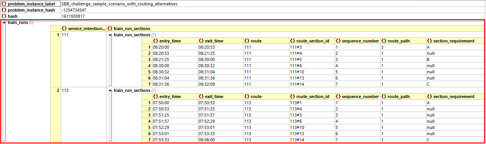
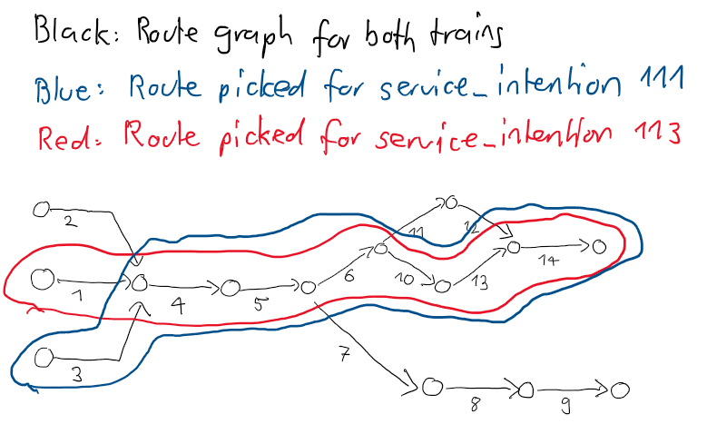
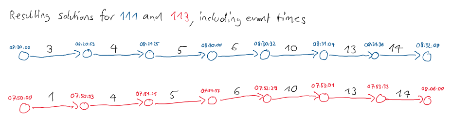

# Output data model
This document describes the data model in which the _solutions_ to the problem instances are expected.

## What is a 'solution'?
A _solution_ to a problem instance must contain the following information for each _service_intention_ in the problem instance:

* A choice of exactly one of all possible routes for this train trough its route graph, and
* assigning a time to each _event_ (entry into and exit from _route_sections_)

For example, a full solution to the [sample instance](sample_files/sample_scenario.json) looks as follows:

The data model is much easier than the one for the [problem instances](documentation/input_data_model.md). Basically, all one has to specify is a list of route_sections one would like to take and give an entry and exit time for each of them. Let's make this precise:

## Data Model of a solution

We keep using this [sample solution](sample_files/sample_scenario_solution.json) to the [sample instance](sample_files/sample_scenario.json), pictured above, as an example.

A _solution_ to a _problem_instance_ has the following elements:
* problem_instance_label 
* problem_instance_hash
* hash
* train_runs

Let's go through them. 

## problem_instance_label 
The _label_ of the _problem_instance_ that this solution is intended for.

## problem_instance_hash 
The _hash_ of the _problem_instance_ that this solution is intended for. This is the actual identifier that the grader script will use to check if your solution is valid and compute its score. It is imperative that this field is filled correctly, otherwise the grader will not be able to match your solution to a problem instance.

## hash
This field can be used to provide a hash-value for the _solution_. However, while the field is technically required, its value is not really used in the context of this Challenge. You may enter any fixed integer, e.g. 42, for every _solution_ you submit.

## train_runs 
This is the actual 'meat' of the _solution_. Namely, it contains for each _service_intention_ an ordered list of _train_run_sections_ that describe a simple path through the [route graph](input_data_model.md#routes) for this train. For each _train_run_section_ it provides a time-of-day for the _entry_time_ and the _exit_time_.

Our [sample solution](sample_files/sample_scenario_solution.json) looks like this:

Translating this into the route-graph picture, we see that the solution picks the following routes for the two _service_intentions_:

This results in the following _train_run_sections_ for the _service_intentions_:

* each arc is a _train_run_section_
* black numbers are the _sequence_number_ of the referred _route_section_
* the times at the nodes are the event times that the solver assigned to the events

Let's look at the formal model for _train_run_sections_

### train_run_section 
A _train_run_section_ is built as follows

| Field                                                                                         | Format                            | Description    |
| -------------     |-------------      | -----         |
| entry_time   | time of day in HH24:MM:SS                         | event time for the _entry_event_ into this _train_run_section_.  __Note__: This time must always be equal to the _exit_time_ of the previous _train_run_section_    |
| exit_time    | time of day in HH24:MM:SS                         | event time for the _exit_event_ from this _train_run_section_.  __Note__: This time must always be equal to the _entry_time_ into the next _train_run_section_    |
| route    | text                         | reference to the _id_ of the _route_ for this _service_intention_ |
| route_path    | text                         | reference to the _id_ of the _route_path_ in which the _route_section_ represented by this _train_run_section_ is located |
| route_section_id    | text                         | reference to the particular _route_section_ that this _train_run_section_ represents. It is built by the pattern '_route_._id_#_route_section_._sequence_number_'. Recall [Axiom 4](documentation/input_data_model.md#axiom-4-key-for-route_sections) states that this combination is indeed a primary key for the route sections. For example, in the sample solution above, the first _train_run_section_ for _service_intention_ 111 references _route_section_ 3 in the route 111. Therefore the _route_section_id_ is '111#3'  .  |
| sequence_number    | positive Integer                         | an ordering for the _train_run_sections_. Necessary because the JSON specification does not guarantee that the order in the file is respected when it is deserialized. |
| section_requirement    | text                         | must be set to the corresponding _section_requirement_ of the service intention if this requirement is to be satisfied on this particular _train_run_section_.   __Note:__  We guarantee (see [Axiom 3](documentation/input_data_model.md#axiom-3-well-behaved-route-graphs)) that the route graphs in our problem instances are such that whatever route you happen to choose (from _any_ source to _any_ sink node), you will pass each required _section_marker_ exactly once. Actually, we even guarantee, that you will pass them in the same sequence as required by the _service_intention_.  So once you have picked your route, you can just check if the _route_section_ referenced by this _train_run_section_ has a _section_marker_ that also occurs in the _service_intention_. If so, put this _section_marker_ in this field.
