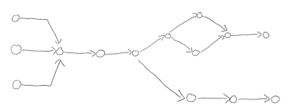

# A Very Quick Introduction to our Timetabling Problem

Our task (or yours, if you are going to build a solver :wink:) is basically the following:

**Given**
* A list of trains to be scheduled, and
* For each train
    - a set of _Functional Requirements_, such as earliest departure time, latest arrival time, minimum stopping times, connections to other trains, etc.
    - a set (actually, a directed acyclic graph) of _routes_ it could take from origin to destination, together with minimum running times on the sections and a list of resources that are occupied while the train is in this section.

**Produce a timetable that**
-	does not violate any functional requirements
-	does not violate any physical requirements, such as minimum running time on a route section
-	does not result in resource occupation conflicts.

A **timetable** is an assignment of a (continuous) time instant to each event.

## What does it mean to 'not violate any functional/physical requirements'?
We have made precise what is considered a _valid_ (or _feasible_) solution through the definition of twelve individual rules. You will learn about them in the document [business rules](business_rules.md).

Basically, a solution must satisfy all twelve rules to be accepted. Actually, there is some leeway, because rule #101 may be bent a little bit, but don't worry about that for the time being.

To give you a flavor of what these rules are like, here are two examples.

* [business rule #2](business_rules.md#concistency-rules) states that the solution must schedule each train in the problem instance. It is not allowed to ignore some of the trains.
* [business rule #104](business_rules.md#planning-rules) states that no two trains may occupy a common resource at the same time

## A note on the 'routes'

A route for a train actually consists of individual `route sections`. The sections attach to one another head-to-tail to form a directed acyclic graph (DAG). Each vertex in this DAG is called an `event`. It represents the event, when a train passes from one section to the next one._ We use the term `route graph` as a synonym for `route` in the following. A simple route graph might look as follows - although realistic example have many more sections, typically between 50 and 100. 

The graph encodes the set of **possible** paths the train can take. The train __must always starts on a source node__ (i.e. a node without incoming arcs) and __must always ends on a sink node__ (a node without outgoing arcs). In order to solve the timetabling problem, you must choose for each train exactly one such path through its route graph. Different paths usually occupy different resources. Also, some paths may be preferable to others; for example some sections may have a penalty associated if they are used. You will learn more about all this in the discussion of the [input data model](input_data_model.md) and the [objective function](business_rules.md#objective-function).
