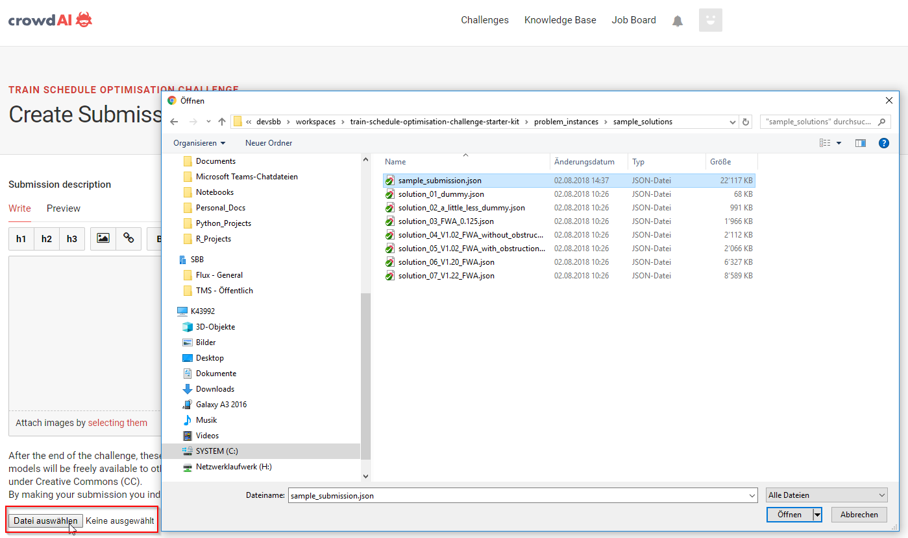

# What and How to Submit?

The submission process is file-based and works through the [Challenge Submission Page on crowdAI](https://www.crowdai.org/challenges/train-schedule-optimisation-challenge/submissions).

The file you submit must a JSON-file containing a list of the solutions you want to submit. 

* It is not necessary to have a solution for all nine problem instances. You may submit solutions for only a subset of the instances (you may even submit an empty list). For each missing solution, a penalty of 10'000 points will be incurred. For example, the [sample submission](../problem_instances/sample_solutions/sample_submission.json) does not contain solutions for instances 08 and 09.
* You must only submit _at most one_ solution for each problem instance. If you submit two solutions for the same problem instance, the submission will be rejected.
* Each solution you submit must conform to the [solution data model](output_data_model.md)

Once you have your submission file, go to the [Submission Page](https://www.crowdai.org/challenges/train-schedule-optimisation-challenge/submissions), click on `CREATE SUBMISION`, select the the submission file. The submission will complete automatically.

